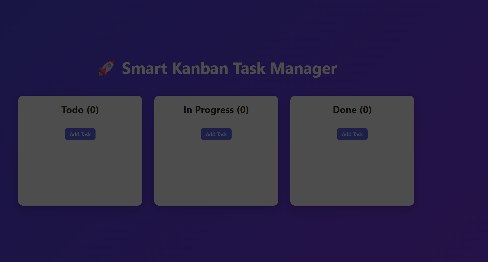
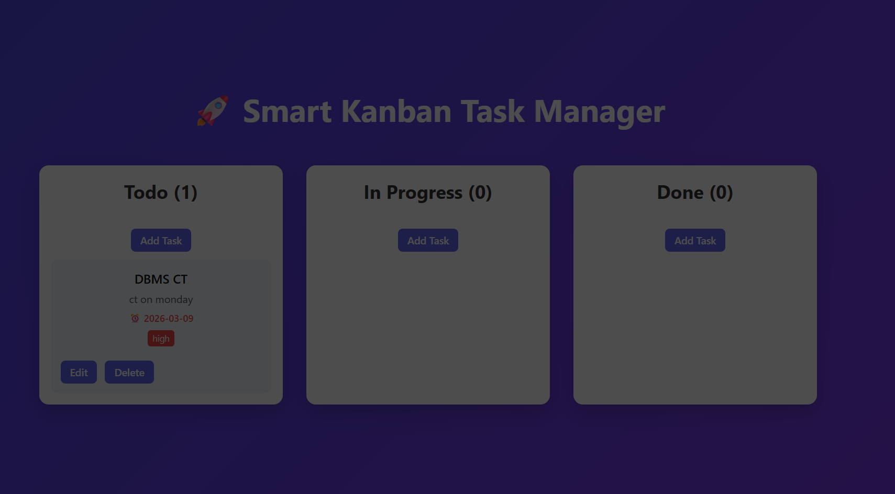
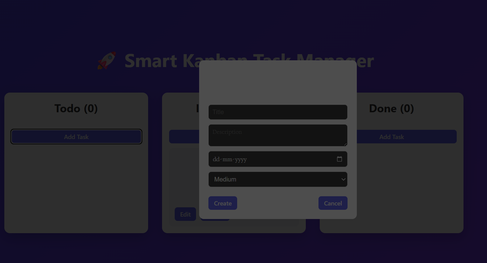
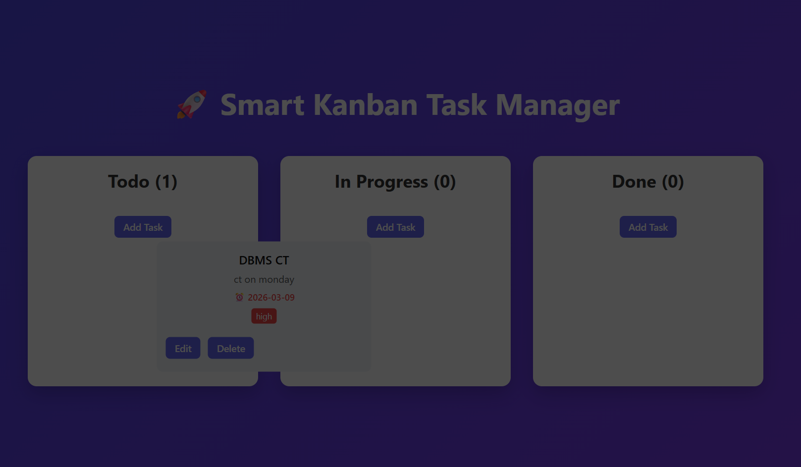

# Smart Kanban Task Manager

A React-based Kanban board that helps users manage tasks across workflow stages.

## Features
- Create tasks with description, deadline, and priority
- Drag and drop tasks between columns
- Edit and delete tasks
- Persistent storage using LocalStorage

## Tech Stack
- React
- JavaScript
- CSS
- @hello-pangea/dnd

## Screenshots

